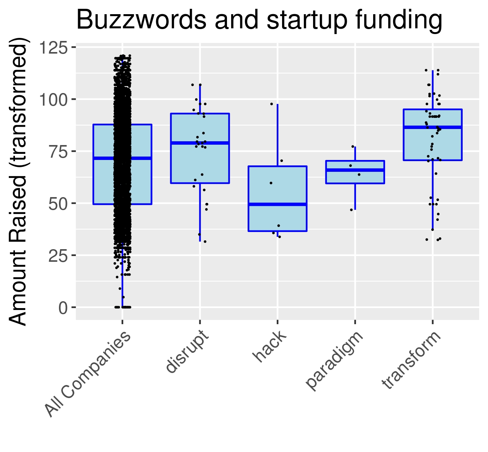
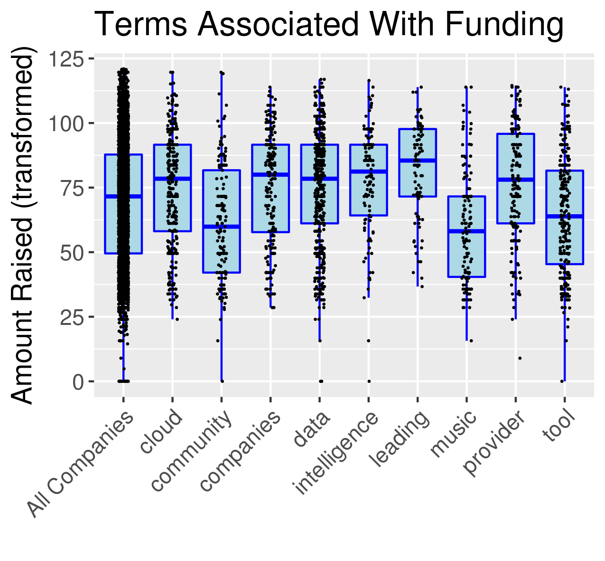

```{r setup, include=FALSE}
knitr::opts_chunk$set(echo = TRUE)
```

 “Disruptive”, “paradigm shift”, “transforming”…. Do these words make you want to fund my hypothetical startup? After pondering why startup companies use this strange jargon, I analyzed startup funding data to discover if the ways that companies present themselves in words has an impact on their ability to accumulate funding. For this analysis, I only looked at initial seed funding, because later financing rounds require tangible results in addition to persuasive words, I also only looked at the years 2012-2015 due to limits on the data. I gathered data from Crunchbase, which includes company-written descriptions of themselves and joined this with a startup funding dataset. These descriptions are a good proxies for the “elevator pitches “that would be given to early investors. 
<br><br><br>

First, I will load the packages and my pre-assembled dataset, which can be found on this github page.


```{r, echo=FALSE, warning=FALSE}
library(readr)
library(dplyr)
library(ggplot2)
library(stringr)
library(caret)
library(text2vec)
library(data.table)

# I preprocessed the Crunchbase data to include startups that received seed funding between 
# 2012 and 2015. I only had access to funding until 2015. I also only look at USA and Canada
d = read_csv("startup_data.csv")
#remove duplicates 
d = d %>% group_by(company_name) %>% arrange(desc(raised_amount_usd)) %>% dplyr::slice(1) %>% ungroup()


```

Let's look at the distribution of seed funding for all companies:

```{r}

d %>% ggplot(aes(x=raised_amount_usd), fill = "lightblue") +
  geom_density(alpha = 0.5, fill = "lightblue") + xlab("Amount Raised") + ggtitle("Seed Funding")
```

The funding is highly skewed. We will apply the Yeo-Johnson transformation. 

```{r}
# yeo-johnson transform to remove skew
d$raised_amount_usd = as.numeric(d$raised_amount_usd)
preprocessData = data.frame(d$raised_amount_usd)
preprocessParams = preProcess(preprocessData, method=c("YeoJohnson"))
print(preprocessParams)
transformed = predict(preprocessParams, preprocessData)
d$transformed_amount = transformed$d.raised_amount_usd
shapiro.test(d$transformed_amount[1:4999])
qqnorm(d$transformed_amount[1:4999]);qqline(d$transformed_amount[1:4999], col = 2)

d %>% ggplot(aes(x=transformed_amount), fill = "lightblue") +
  geom_density(alpha = 0.5, fill = "lightblue") + xlab("Amount Raised") + ggtitle("Seed Funding, Transformed")

```


The new data looks more normal, but is not normal according to the Sapiro test. We will use Mann-Whitney to test for relationships between a set of words and the funding. First, we will look at the words: "disrupt", "paradigm", "hack", and "transform".

```{r}
# get some summary statistics for a few terms
terms = c("disrupt", "paradigm", "hack", "transform")
stat_table = d %>% mutate(term = "All Companies") %>% select(term, transformed_amount)
for (i in 1:length(terms)){
  data_temp = d[grepl(terms[i], d$short_description, ignore.case = TRUE),]
  data_temp$term = terms[i]
  data_temp = select(data_temp, term, transformed_amount)
  stat_table = bind_rows(stat_table, data_temp)
}
ggplot(stat_table, aes(x=term, y=transformed_amount)) + 
  geom_boxplot(outlier.shape=NA, color = "blue", fill = "lightblue") + 
  geom_jitter(position=position_jitter(width=.1, height=0), size = 0.1) +
  theme(axis.text.x = element_text(angle = 45, hjust = 1), text = element_text(size=14), 
        legend.position="bottom") + xlab("") + ylab("Amount Raised (transformed)") + 
  ggtitle("Buzzwords and startup funding")
ggsave("plot1.png")

p_values_1 = rep(NA, length(terms))
d_data = d$transformed_amount
for(i in 1:length(terms)){
  y1 = d[grepl(terms[i], d$short_description, ignore.case = TRUE), ]
  y2 = d[!grepl(terms[i], d$short_description, ignore.case = TRUE), ]
  p_value = wilcox.test(y1$transformed_amount, y2$transformed_amount, alternative = "two.sided", paired = FALSE)
  p_values_1[i] = p_value$p.value
  print(i)
}
p_values_1 = p.adjust(p_values_1, method = "hochberg", n = length(p_values_1))
results_table_1 = tibble(terms = terms, adj_p_values = p_values_1)
results_table_1 = results_table_1 %>% arrange(adj_p_values) %>% filter(adj_p_values < 0.05)
print(p_values_1)

```



The p-value for "transform" is significant (p = 0.003), and the effect looks modest but real.  Now, let's use the text2vec package to perform hypothesis tests for all words that appear in more than 1% of descriptions. 


```{r}
# make a full bag of words model

dd = d
setDT(dd)
setkey(dd, company_name)
set.seed(2016L)
prep_fun = tolower
tok_fun = word_tokenizer

it_train = itoken(dd$short_description, 
                  preprocessor = prep_fun, 
                  tokenizer = tok_fun, 
                  ids = dd$company_name, 
                  progressbar = TRUE)
vocab = create_vocabulary(it_train)
rm(dd)
vocab_table = vocab[[1]]
# keep words that appear in less than 25% of documents and in at least 4 documents
vocab_table = vocab_table[vocab_table$doc_counts > (nrow(d) * 0.01) & vocab_table$doc_counts < (nrow(d) * 0.25), ]
terms = vocab_table$terms
grep("paradigm", terms)

# let's do a bunch of t tests then correct for fdr
p_values = rep(NA, length(terms))
d_data = d$transformed_amount
for(i in 1:length(terms)){
  y1 = d[grepl(terms[i], d$short_description, ignore.case = TRUE), ]
  y2 = d[!grepl(terms[i], d$short_description, ignore.case = TRUE), ]
  p_value = wilcox.test(y1$transformed_amount, y2$transformed_amount, alternative = "two.sided", paired = FALSE)
  p_values[i] = p_value$p.value
}
p_values = p.adjust(p_values, method = "hochberg", n = length(p_values))
results_table = tibble(terms = terms, adj_p_values = p_values)
results_table = results_table %>% arrange(adj_p_values) %>% filter(adj_p_values < 0.05)

# get summary statistics for terms that are above adjusted p value cutoff
terms = results_table$terms
stat_table = d %>% mutate(term = "All Companies") %>% select(term, transformed_amount)
for (i in 1:length(terms)){
  data_temp = d[grepl(terms[i], d$short_description, ignore.case = TRUE),]
  data_temp$term = terms[i]
  data_temp = select(data_temp, term, transformed_amount)
  stat_table = bind_rows(stat_table, data_temp)
}
ggplot(stat_table, aes(x=term, y=transformed_amount)) + 
  geom_boxplot(outlier.shape=NA, color = "blue", fill = "lightblue") + 
  geom_jitter(position=position_jitter(width=.1, height=0), size = 0.1) +
  theme(axis.text.x = element_text(angle = 45, hjust = 1), text = element_text(size=14), 
        legend.position="bottom") + xlab("") + ylab("Amount Raised (transformed)") + 
  ggtitle("Terms Associated With Funding")
ggsave("plot4.png")


```





Nine words were statistically significant after controlling for multiple hypothesis testing. Some (“data” and “cloud” – good, “music” – bad) correctly identified market trends during the time period. But others (“leading” - good; “community” - bad) had associations with funding that should be analyzed in future work. Most effects appear modest. My future goals are to replace the Crunchbase company description with a description scraped from the web, and make sure the description appeared around the time of the seed funding. Additionally, I plan to build a statistical model that uses this data to predict seed funding. This model will useful to startups looking for effective ways to market themselves to investors.
